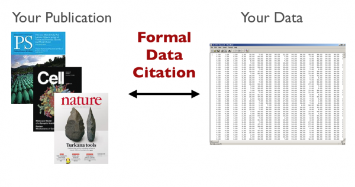
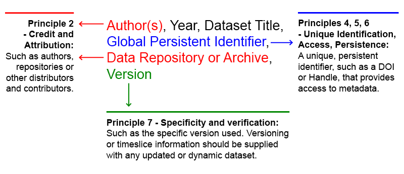

.. _data-citation:

Get Recognition: Data Citation
+++++++++++++++++++++++++++++++++++++++

|image1|

Dataverse standardizes the citation of datasets to make it easier for
researchers to publish their data and get credit as well as **recognition** for
their work. When you create a dataset in Dataverse, the citation is generated and presented
automatically. As an open source framework and research data
repository, Dataverse is committed to helping researchers, journals,
and organizations make scientific data accessible, reusable, and open
(when possible), which includes implementing community accepted
standards for data publication (Altman & Crosas 2013). For nearly 20 years, members of `IQSS <http://www.iq.harvard.edu/>`_ and its `Data Science <http://datascience.iq.harvard.edu/>`_
team, who work on Dataverse, have played an active part in the
the work to standardize data citation (King
1995, Altman & King 2007, Altman & Crosas 2013). Illustrated in the figure below, is an example of how
the data citation is formulated in Dataverse, using the `Joint
Declaration of Data Citation Principles (2014)
<https://www.force11.org/datacitation>`_ : a 
synthesis of all previously existing principles and initiatives on
data citation..

|image2|
Fig. 1 Example of a Data Citation based on the the `Joint
Declaration of Data Citation Principles (2014)
<https://www.force11.org/datacitation>`_.

In addition to getting recognition with a citation you can also make
your particular Dataverse recognizable by setting up your own branding
in `Dataverse Theme + Widgets <http://guides.dataverse.org/en/latest/user/dataverse-management.html#theme-widgets>`__.

**References**

#. King, Gary. 1995. Replication, Replication. PS: Political Science and Politics 28: 443–499. `Link <http://gking.harvard.edu/files/abs/replication-abs.shtml>`_.
#. Altman, Micah, and Gary King.  2007 . "A proposed standard for the scholarly citation of quantitative data." *D-lib Magazine* 13.3/4. `Link <http://www.dlib.org/dlib/march07/altman/03altman.html>`_.
#. Altman, Micah, and Mercè Crosas. 2013. "The Evolution of Data Citation: From Principles to Implementation." *IASSIST Quarterly* 2013;37. `Link <http://www.iassistdata.org/iq/evolution-data-citation-principles-implementation>`_.

.. include:: standard.rst
